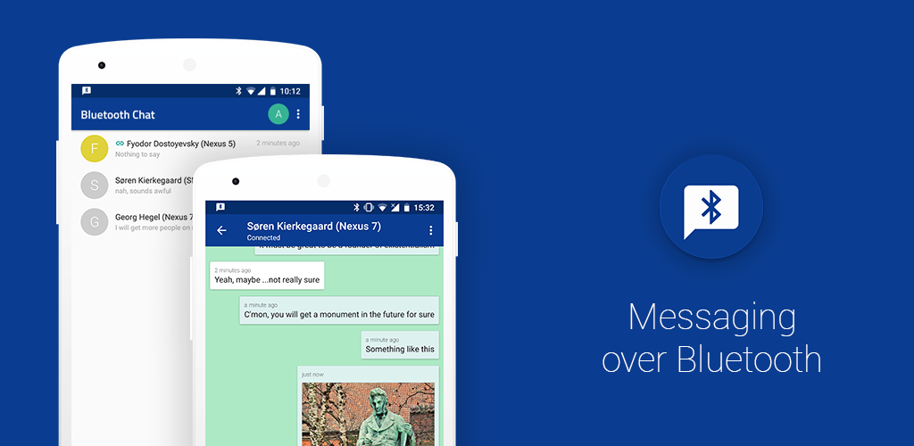

# ChatBLE

An offline, peer-to-peer Android messaging app that communicates over standard Bluetooth RFCOMM (SPP) sockets. No internet, cell service, accounts, or backend servers required.

<p align="center">
  
</p>

## Overview

ChatBLE connects two nearby Android phones directly through Bluetooth. Once paired, devices can exchange instant text messages, see delivery and read receipts, and send compressed images using a custom binary framing protocol over RFCOMM input/output streams.

The app is built in Kotlin using an MVP architecture with Room for local chat history and a background foreground service that keeps socket connections alive even when the app is minimized.

## Features

- **P2P Offline Chat**: Direct socket-to-socket messaging without routing through any external network.
- **Image Sharing**: Chunked binary transfer over Bluetooth with real-time transfer progress and cancellation support.
- **Message Status Indicators**: Real-time status tracking for sent, delivered, and read receipts.
- **Interactive Notifications**: Foreground connection service supporting Android quick-reply from notifications and tap-to-accept connection requests.
- **Local Persistence**: Messages, conversation history, and contact metadata stored locally in SQLite via Room.
- **Modern UI**: Styled with Material Design 3 aesthetics, including rounded chat bubbles, floating input bar, and full Light/Dark mode support.
- **APK Beaming**: Share the app's own APK file over Bluetooth from inside the scanner screen so friends nearby can install it without Play Store access.

## Architecture & Tech Stack

- **Language**: Kotlin
- **Pattern**: Model-View-Presenter (MVP)
- **Dependency Injection**: Koin
- **Local Database**: AndroidX Room (SQLite)
- **Concurrency**: Kotlin Coroutines + dedicated Java I/O background threads
- **Image Loading**: Picasso & PhotoView (pinch-to-zoom)
- **CI/CD**: GitHub Actions workflow automatically building and attaching APKs to GitHub Releases

### Wire Protocol

Messages over the RFCOMM stream are framed as text commands separated by a delimiter (`#`):

```
<type>#<uid>#<flag>#<body>
```

Payload types handle connection requests, handshakes with avatar/color metadata, delivery confirmations, read receipts, and file transfer boundaries (`FILE_START`, byte stream, `FILE_END`).

## Getting Started

### Prerequisites

- Android Studio (Hedgehog or newer recommended)
- JDK 11
- Android SDK with build-tools (minSdkVersion 19, targetSdkVersion 28+)
- Physical Android device with Bluetooth hardware (emulators do not support physical Bluetooth connections)

### Building the Project

1. Clone the repository:
   ```bash
   git clone https://github.com/sanyoog/ChatBLE.git
   cd ChatBLE
   ```

2. Build debug APK:
   ```bash
   ./gradlew assembleDebug
   ```

The compiled APK will be generated under `app/build/outputs/apk/debug/app-debug.apk`.

### Prebuilt APKs

Ready-to-install APKs are compiled automatically on every tag and release via GitHub Actions. You can download them directly from the [Releases](https://github.com/sanyoog/ChatBLE/releases) tab.

## License

This project is licensed under the MIT License. See the [LICENSE](LICENSE) file for details.
