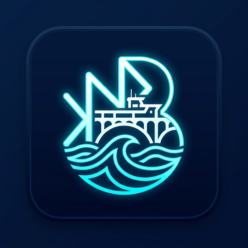

# SagarSetu_BLEC

**Tactical Offline Bluetooth Communication & Mesh Field Terminal for Android**

An infrastructure-independent, peer-to-peer communicator designed for maritime operations, off-grid field teams, remote expeditions, and emergency response where cellular coverage, internet gateways, or satellite links are unavailable or compromised.

<p align="center">
  
</p>

<p align="center">
  <a href="https://github.com/sanyoog/ChatBLE/releases"></a>
  
  
  
</p>

---

## Capabilities

- **Zero-Infrastructure P2P Communications**: Direct device-to-device communication established over hardware Bluetooth RFCOMM sockets (SPP). No SIM cards, accounts, cellular towers, or cloud servers.
- **Tactical High-Contrast Interface**: Deep-navy slate interface (`#0C1427`) optimized for low-light night-bridge operations and harsh daylight visibility with high-legibility typography.
- **5-Tab Operational Terminal**:
  - **Scan**: Radar discovery and pairing utility for nearby nodes.
  - **Media**: Secure local gallery for received image intelligence.
  - **Chat**: Primary operational messaging console with real-time delivery and hop confirmations (`ᛒ BLE MESH • 1 HOPS ✓✓`).
  - **Profile**: Node identity management, avatar selection, and tactical callsign configuration.
  - **Settings**: Audio alerts, vibration triggers, connection limits, and background telemetry preferences.
- **Binary Imagery & Telemetry Streaming**: Chunked payload protocol for transferring reconnaissance images and binary data over raw RFCOMM streams with live progress monitoring and abort controls.
- **Persistent Connection Service**: Low-power Android foreground daemon maintaining socket links even when the handset is locked or backgrounded.
- **Air-Gapped Node Beaming**: Directly transmits the installable APK file over Bluetooth to provision unequipped field devices without app store or web access.
- **Encrypted Local Sandbox**: Complete chat logs and cryptographic identifiers stored exclusively on device hardware using local SQLite via Room.

---

## Technical Specifications

| Specification | Details |
|---|---|
| **Architecture** | Model-View-Presenter (MVP) with Clean Architecture Layering |
| **Language** | Kotlin 1.3.x / Java 11 bytecode |
| **Transport Layer** | Bluetooth RFCOMM / Serial Port Profile (SPP) |
| **Database** | AndroidX Room (Encrypted SQLite storage) |
| **Dependency Injection** | Koin |
| **Concurrency** | Kotlin Coroutines + dedicated low-latency I/O threads |
| **Target Platforms** | Android 4.4 KitKat (API 19) through Android 14+ |

### Framing Protocol

All communication across the RFCOMM data pipe utilizes framed header packets:

```
<PAYLOAD_TYPE>#<MESSAGE_UID>#<FLAG>#<BODY_CONTENT>
```

Payload types control connection negotiation, presence handshakes, delivery acks, read receipts, and file chunk boundaries (`FILE_START`, raw byte array chunks, `FILE_END`).

---

## Installation & Releases

### Download Precompiled APK

Installable APK builds are compiled on GitHub Actions CI/CD for every tagged release:

- **Download**: [SagarSetu_BLEC Releases](https://github.com/sanyoog/ChatBLE/releases)
- **Primary Package**: `SagarSetu_BLEC.apk`

---

## Building from Source

### Requirements
- JDK 11 (Adoptium Temurin recommended)
- Android SDK Build-Tools (API 28+)
- Physical Android handset with physical Bluetooth radio (Android emulators lack hardware Bluetooth transceiver support)

### Build Commands

1. Clone the project repository:
   ```bash
   git clone https://github.com/sanyoog/ChatBLE.git
   cd ChatBLE
   ```

2. Assemble debug APK:
   ```bash
   ./gradlew assembleDebug
   ```

3. Compiled output will be generated at:
   ```
   app/build/outputs/apk/debug/SagarSetu_BLEC-debug.apk
   ```

---

## License

This software is licensed under the [MIT License](LICENSE).
